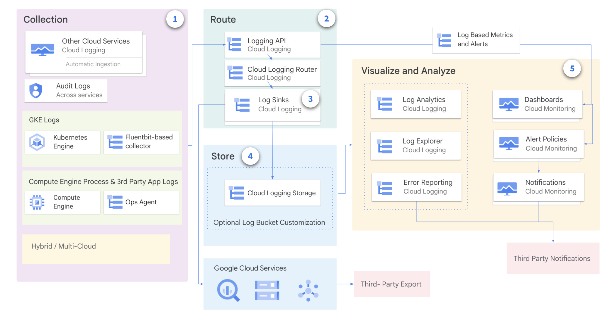
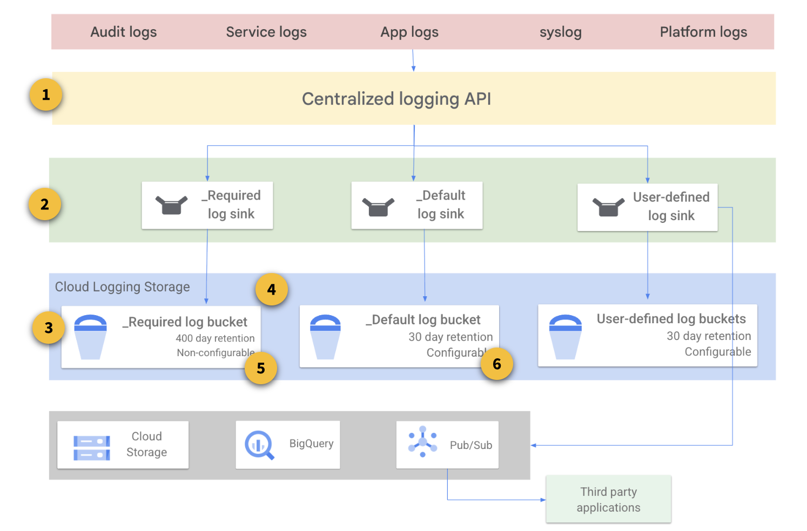

# Cloud Logging 

- Cloud Logging is a **real-time log-management system** with **storage**, **search**, **analysis**, and **monitoring** support.

- Cloud Logging **automatically collects log data** from **Google Cloud resources**. 
- You can also **configure alerting policies** so that **Cloud Monitoring** notifies you when certain kinds of events are reported in your log data. 

## Cloud Logging Use Cases

- **Gather data from various workloads**: This data is required to **troubleshoot** and **understand the workload** and **application needs**.
- **Analyze large volumes of data**: Tools like **Error Reporting**, **Log Explorer**, and **Log Analytics** let you focus from large sets of data.
- **Route and store logs**: Route your logs to the region or service of your choice for additional compliance or business benefits.
- **Get Compliance Insights**: Leverage **audit** and **app logs** for **compliance patterns** and **issues**. 

## Cloud Logging Architecture

Cloud Logging architecture consists of several components:

1. **Log Collections**: These are the places where **log data originates**. **Log sources** can be **Google Cloud services**, such as Compute Engine, App Engine, and Kubernetes Engine, or **your own applications**.
2. **Log Routing**: The Log Router is responsible for **routing log data to its destination**. The Log Router uses a combination of **inclusion filters** and **exclusion filters** to determine which log data is routed to each destination.
3. **Log sinks**: Log sinks are **destinations** where **log data** is **stored**.
4. **Store Logs**: Cloud Logging supports a **variety of log sinks**, including:
    - **Cloud Logging log buckets**: These are **storage buckets** that are **specifically designed** for **storing log data**.
    - **Pub/Sub topics**: These topics can be used to **route log data to other services**, such as third-party logging solutions.
    - **BigQuery**: This is a fully-managed, petabyte-scale **analytics data warehouse** that can be used to **store** and **analyze** log data.
    - **Cloud Storage buckets**: Provides storage of log data in **Cloud Storage**. Log entries are stored as **JSON files**.
5. **Log Analysis**: Cloud Logging provides several **tools** to **analyze logs**:  
    - **Logs Explorer** is optimized for **troubleshooting** use cases with features like **log streaming**, a **log resource explorer** and a **histogram for visualization**. 
    - **Error Reporting** help users react to critical application errors through **automated error grouping** and **notifications**. 
    - **Logs-based metrics**, **dashboards** and **alerting** provide other ways to understand and make logs actionable. 
    - **Log Analytics** feature expands the toolset to include **ad hoc log analysis capabilities**.

## Log Types and Collections

Key **log categories**:

- **Platform Logs**: written by **Google Cloud services** (e.g. VPC, Cloud Storage or BigQuery). These logs can help you **debug** and **troubleshoot** issues and better understand the services you are using.
    - **Serverless compute services** like **Cloud Run** and **Cloud Run functions** include **simple runtime logging by default**. Logs written to `stdout` or `stderr` will appear automatically
- **Component Logs**: similar to platform logs, but they are **generated by Google-provided software components that run on your system**. For example, GKE provides software components that users can run on their VMs or in their own data centre. Logs are generated from the user's GKE instances and sent to a user's Cloud project.
- **Security Logs**: they help you answer "*who did what, where and when*".
    - **Cloud Audit Logs**: provide information about **administrative activities** and **accesses** within your **Google Cloud resources**.
    - **Access Transparency**: provides you with **logs of actions taken by Google staff** when accessing your Google CLoud content
- **User-written logs**: written by **custom applications** and services (e.g. via **Ops Agent**, **Cloud Logging API**, Cloud Logging client libraries)
- **Multi/Hybrid Cloud Logs**: logs from other cloud providers and from on-premises infrastructures

## Storing, Routing and Exporting the Logs

Logs can be routed and stored for long-term storage and analysis.

**Cloud Logging** is a **collection of components** exposed through a **centralised logging API**:

1. **Log Router**: Entries are passed through the API and fed to Log Router. Log Router is **optimized** for processing **streaming data**, reliably buffering it, and sending it to any combination of log storage and sink (export) locations. By default, log entries are fed into one of the default logs storage buckets. **Exclusion filters** might be created to partially or totally prevent this behavior.
2. **Log Sinks**: Log sinks **run in parallel with the default log flow** and might be used to direct entries to external locations.
3. **Log Storage**: Locations might include **additional Cloud Logging buckets**, **Cloud Storage**, **BigQuery**, **Pub/Sub**, or **external projects**. **Inclusion** and **exclusion filters** can control exactly which logging entries end up at a particular destination, and which are ignored completely.
4. **Required Bucket**: holds **Admin Activity audit logs**, **System Event audit logs**, and **Access Transparency logs**, and **retains** them for **400 days**. You **aren't charged** for the logs stored in Required, and the **retention period** of the logs stored here **cannot be modified**. You **cannot delete** or **modify** this bucket.
5. **Logs Buckets**: For each Google Cloud project, Logging automatically creates two logs buckets, **_Required** and **_Default**, and **corresponding log sinks** with the same names. All logs generated in the project are stored in one of these two locations.
6. **Default Bucket**: **holds all other ingested logs** in a Google Cloud project, except for the logs held in the Required bucket. [**Standard Cloud Logging pricing**](https://cloud.google.com/stackdriver/pricing#logging-costs) applies to these logs. Log entries held in the Default bucket are **retained for 30 days**, unless you apply [custom retention](https://docs.cloud.google.com/logging/docs/routing/overview#custom-retention) rules. **You can't delete this bucket**, but you can [**disable** the Default](https://docs.cloud.google.com/logging/docs/export/configure_export_v2#disabling_sink) log sink that routes logs to this bucket.

### Logs Storage
The **Logs Storage page** displays a **summary of statistics** for the **logs** that your **project** is receiving.

You can view the **total usage by resource type** for the **current total volume**. The link opens **Metrics Explorer**, which lets you build charts for any metric collected by your project.

1. **Current total volume**: The amount of logs your project has received since the first date of the current month.
2. **Previous month volume**: The amount of logs your project received in the last calendar month.
3. **Projected volume by End Of Month (EOM)**: The estimated amount of logs your project will receive by the end of the current month, based on current usage.

### Log router sinks and sink locations

**Log Router sinks** can be used to forward copies of some or all of your log entries to non-default locations. Use cases include storing logs for extended periods, querying logs with SQL, and access control.

There are **several sink locations**, depending on need:

- **Cloud Logging bucket** works well to help pre-separate log entries into a distinct log storage bucket.
- **BigQuery dataset** allows the SQL query power of BigQuery to be brought to bear on large and complex log entries.
- **Cloud Storage bucket** is a simple external Cloud Storage location, perhaps for long-term storage or processing with other systems.
- **Pub/Sub topic** can export log entries to message handling third-party applications or systems created with code and running somewhere like Dataflow or Cloud Run functions.
- **Splunk** is used to integrate logs into existing Splunk-based system.
- The **Other project option** is useful to help control access to a subset of log entries.

### Aggregation levels

A common logging need is **centralized log aggregation** for **auditing**, **retention**, or **non-repudiation purposes**.

**Aggregated sinks** allow for easy exporting of logging entries without a one-to-one setup. The sink destination can be any of the destinations discussed up to now.

There are **three** available **Google Cloud Logging aggregation levels**:
- **Project-level** log sink: it exports all the logs for a specific project and a log filter that can be specified in the sink definition to include/exclude certain log types
- **Folder-level** log sink: it aggregates logs on the folder level and can include logs from children resources (subfolders, projects etc)
- **Organisation-level** log sink: for a global view, this aggregation can include logs from children resources (subfolders, projects)

## References

- [Cloud Logging overview](https://docs.cloud.google.com/logging/docs/overview)
- [Cloud Logging overview and architecture](https://www.skills.google/course_templates/99/html_bundles/621228)