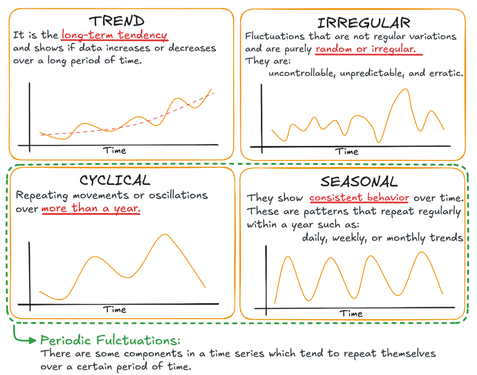

# Time Series and Forecasting Fundamentals

## 1. Sequence models

A sequence includes any data where the **order** of the data items matters (e.g. a sentence is an ordered sequence of words, not just any sequence of words). In other words, sequences are data points that can be **meaningfully ordered**, so that **earlier observations provide information about later observations**. 

- Simple definition of **Forecasting** --> You should be able to take a **slice of past observations** and use them to get a **better-than-chance prediction of later observations**.

- **Sequences** can be either the **input** or the **output** of a machine learning **model**. According to this perspective, we can fit sequence models into three types:
    - **One-to-sequence**: **one input** is passed in and the model generates a **sequence as the output**. A typical example is image captioning where one image is given as input to generate its textual description (e.g. a few sentences)
    - **Sequence-to-one**: a **sequence is the input** to the model and **one output is generated**. Sentiment analysis is a typical sequence-to-one problem, based on the comments or few sentences, the machine can generate one rating.
    - **Sequence-to-sequence**: **sequence is both the model's input and output**. Google Translate is an example of a model that delas with sequence-to-sequence problems

### Applications of sequence models

- Solve **forecasting** problems (e.g. sales, demand, weather and traffic forecasting)
- Solve **natural language processing** (**NLP**) problems (e.g. machine translation, speech recognition and sentiment analysis)
- Solve computer vision problems (e.g. image or video generation, captioning)

## 2. Time series patterns

A **time series** is a **series of data points indexed/listed in time order**. This is in contrast with other sequence models, such as NLP (where the order is based on the position of words in sentences) or computer vision (where the order relies on frames), etc...

*From [https://www.statology.org/understanding-time-series-in-python/](https://www.statology.org/understanding-time-series-in-python/)*

Although time series can take different shapes and sizes, they show a common few patterns, including 
- **Trend pattern**: a **gradual increase or decrease pattern over time** (e.g. increasing housing price in the past decade; decreasing birth rate since 1980)
- **Seasonal pattern**: a **recurring pattern over successive period**s. Data is affected by **calendar factors** (e.g. time of the day, day of the week or month of the year) and the **pattern** is **repeated at a known and fixed frequency** (e.g. peak hours at a coffee shop or hiloday seasons of a retail store). A time series may show multiple seasonality.
    - Vertex AI does a godd job in detecting multiple seasonalities in time series 
- **Cyclical pattern**: it exhibits **fluctuations in a recurring pattern**, which however **do not occur at a fixed frequency or the same amplitude**. The time series showing a cyclical pattern is often affected by **economic cycles** (e.g. unemployment rate over the past few decades). 
    - A cyclical pattern is **easily confused with a seasonal pattern**: 
        - Their major difference relies on the **frequency (or regularity) of the pattern**. If the **fluctuations are at a fixed frequency** and are **related to calendar factors**, the pattern is **seasonal**. 
        - Another difference is that the **amplitude of the seasonal pattern** is **usually the same**, whereas the **amplitude of the cyclical pattern** can be **different**
        - A third difference (which might not apply to all cases) is the **length of one cycle**. A **seasonal pattern normally happens within a season** (e.g. year one or two) whereas a **cyclical pattern normally occurs during a long period of time** (e.g. one or more decades)
- **Noise (irregular) pattern**: it shows **random fluctuations rise and fall around a flat line** (or a number). There isn't a predictable trend. A good forecasting model should in theory catch the noise from the historical data and simply perpetuate the last value forward as a flat forecast (naive forecast). Identifyin noise answers a crucial question: when should you stop fitting the model?

A **time series** is often an **aggregation** or a **combination of these patterns**. **Time series analysis** aims to **discover these patterns** and **make predictions** by **using different techniques**.

## 3. Time series analysis

### What type of use cases involve a time series?

There are two types: 
- **Forecasting**: you **predict the future** (a **sequence of values**) by **identifying the patterns and trends of historical data**. It has been overwhelmingly used in business paractice and will be the focus of the rest of the course 
- **Analysis**: you **classify different time series**, **discover clusters** and **detect anomalies**

### What are the methods and techniques used in time series forecasting?

- **Qualitative methods**: rely on human expert judgement. You normally use it when no historical data is available or applicable. For example, the sales forecasting in a startup company might depend on a combination of factors such as industry, economy and competing companies instead of its own historical data
- **Quantitative methods**: used when the past data is available and can be quantified. Also, you can assume that the pattern in the past data remains unchanged in the future. Two major quantitaive techniques can be used:
    - Statistical models
    - Machine Learning models (deep learning)

#### AutoRegressive Integrated Moving Average (ARIMA) models

- **ARIMA** is a **family of statistical models** used in time series forecasting (variants include AR, MA, ARMA and seasonal ARIMA or SARIMA)
- **BQ ML** on Google Cloud is based on the ARIMA model

#### Machine Learning (ML) models
- **Deep learning (DL) ML models** have been used for forecasting: 
    - **convolutional neural networks (CNNs)**
    - **deep neural networks (DNNs)**: deep neural networks with multiple hidden layers
    - **recurrent neural networks (RNNs)**: a neural network with short-term memory
    - **gate recurrent units (GRUs)**
    - **long short-term memory networks (LSTMs)**: a neural network with long-term memory
    - **gate recurrent units (GRUs)**: an improved and simplified variant of LSTM
    - **transformers**: they introduce self-attention and feed-forward layers in both decoder and decoder architectures
- **Tree-based ML models**
    - **extreme gradient boosting (XGBoost)**

**Benefits of using DL models** for forecasting: 
- they can **process a large amount** of **diversified data**:
    - rich metadata (e.g.: product attributes, location attributes)
    - historical factors (e.g.: inventory, weather)
    - factors known in the future (e.g.: planned promotions or events, holidays)
    - unstructured data (such as text)
- they can **model complex scenarios**:
    - cold start or new items
    - short product life cycles
    - burstiness, sparsity
    - hierarchical forecast

**AutoML with Vertex AI Forecast** chooses and configures DL models for you. It uses a technology called **neural architectural search**, to **automatically search the best fit models** among hundreds of ML models and **tune the parameters** for you. You can focus on specifying the business requirements, identify the features that contribute to the forecasting and apply the foreacasting resutls to make downstream business decisions.

## 4. Forecasting notations
