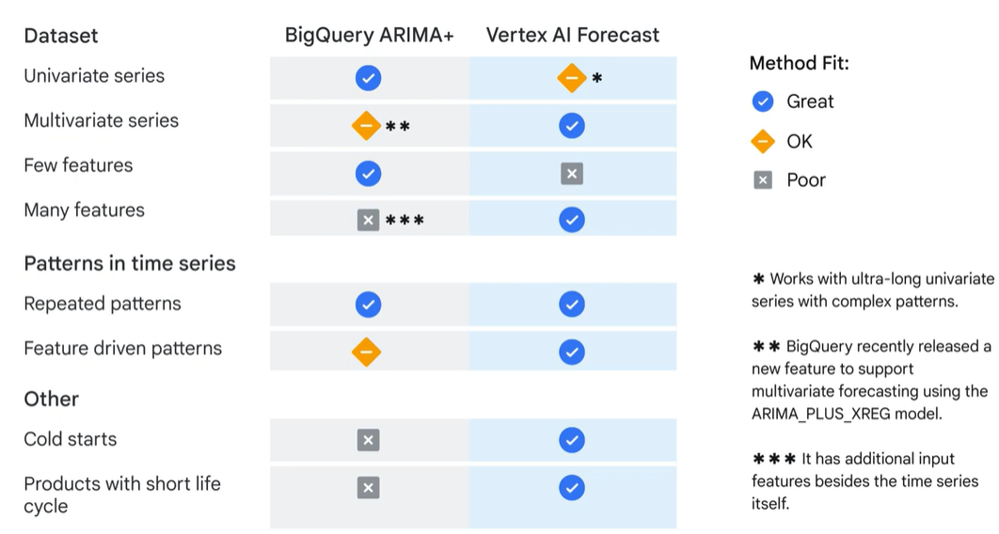
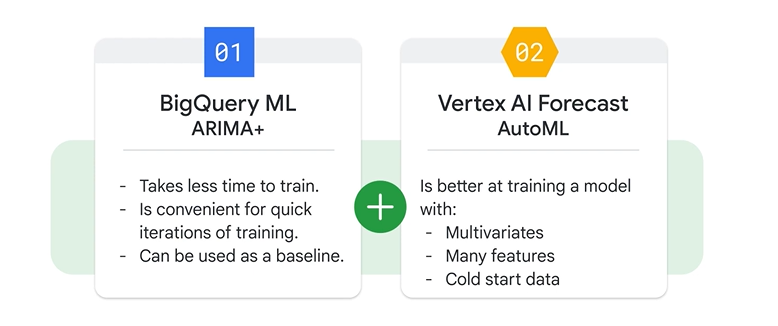

# Forecasting Options on Google Cloud

## 1. Forecasting Options

Accurate forecasting is critical in practice, but there are **challenges** faced by current **forecasting solutions**:

- They usually require both **domain knowledge** and **technical skills**
- They require **significant manual efforts** in **model construction**, **feature engineering** and **hyper-parameter tuning**
- They **can't handle** a **large amount** of **diverse data** and make accurate predictions

### Google Cloud Forecasting Solutions

To address these challenges, **Google Cloud** provides **two primary options** to build a **time series forecasting model**:
- **BigQuery ML**: a **low-code solution** to **build a forecast model** with **ARIMA+**
- **Vertex AI Forecast**: a **no-code UI-based solution** to build a forecast model with **AutoML**

These options aim to **reduce the manual work** and allow data scientists to **focus on business needs** instead of technical operations. They also apply **state-of-the-art ML technologies** to handle **large amounts of data** and **improve accuracy** of **predictions**

Let's look at the **general forecasting workflow** and the **key features** of each option:

From [https://cloud.google.com/blog/topics/developers-practitioners/vertex-forecast-overview](https://cloud.google.com/blog/topics/developers-practitioners/vertex-forecast-overview)

1. **Define** your **time series data** (schema and target)
2. **Join the data** from **multiple datasets** (if required, e.g. supporting datasets containing additional features: attributes and/or covariates). The process of choosing which data to include and deciding the best way to represent it is called **feature engineering** (for example, categorical variables such as country and region need to be transferred to numeric variables to be included in the forecasting model). 
3. **Vertex AI option** (**Deep Learning (DL) model** through UI and Python SDK). **AutoML** automatically performs: **feature engineering**, **model selection**, **hyperparameter tuning**, **ensemble**
4. **BigQuery ML** (**Statistical model** through SQL or SDK). **ARIMA+** automatically performs: **missing-values imputation**, **holiday effects adjustments**, **seasonal** and **trend decomposition**, **spike** and **anomaly identification**
5. **Evaluate model behaviour**
6. **Create** and **visualise forecasts**

#### BigQuery ML ARIMA+ vs Vertex AI Forecast comparison

- **Univariate time series**: when the data only contains **one target variable** changing over time (e.g. daily sales of one product), **BQ ML ARIMA+** is recommended because it is based on a statistical model, which takes **less time to train**
- **Multivariate time series**: **multiple target variables** are changing over time (e.g. daily sales of various products), **Vertex AI Forecast is a good choice** because it benefits from DL models and preforms better with a **global model combining multiple time series**. However, **BQ ML** has recently added a new feature to support multivariate forecasting using the `ARIMA_PLUS_XREG` model.
- **Number of features**: **BQ ML ARIMA+** works bets when **fewer features** are included in the forecast, while **Vertex AI Forecast** works bets when **many features** are involved. This is because Vertex AI can detect the relationships and incorporate the dependencies among these features used in an ML model.
- **Repeated patterns**: both **BQ ML ARIMA+** and **Vertex AI Forecast** can detect them. However, the **latter** can also extract and then extrapolate upon **feature-driven patterns**.
- **Sparse data**: **Vertex AI Forecast** performs better with **cold starts** and **products with short life cycle**.

In summary: **BQ ML ARIMA+** is better for **univariate time series data with few features and repeated patterns**, while **Vertex AI Forecast** is good at handling **multivariate data** (due to its capability of modelling covariates), **data with many features**, **cold starts** and **products with a short life-cycle**. 

You can also use them in tandem when you have a heterogeneous time series dataset (simpler and more complex data):

In addition to **AutoML** (which let's you build high-qaulity models with minimal effort and limited ML expertise), **Vertex AI Forecast** also provides **Custom training**, a more advanced method that let's you run any **custom container with training applications** in the cloud (so you can train a forecasting odel from scratch and build the pipeline manually with code)

## 2. Forecasting with BigQuery ML

## 3. Vertex AI

## 4. Vertex AI Forecast Workflow

## 5. Build Demand Forecasting with BigQuery ML