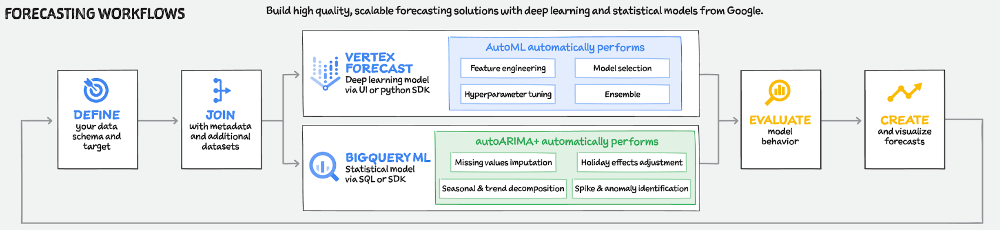

# Forecasting Options on Google Cloud

## 1. Forecasting Options

Accurate forecasting is critical in practice, but there are **challenges** faced by current **forecasting solutions**:

- They usually require both **domain knowledge** and **technical skills**
- They require **significant manual efforts** in **model construction**, **feature engineering** and **hyper-parameter tuning**
- They **can't handle** a **large amount** of **diverse data** and make accurate predictions

To address these challenges, **Google Cloud** provides **two primary options** to build a **time series forecasting model**:
- **BigQuery ML**: a **low-code solution** to **build a forecast model** with **ARIMA+**
- **Vertex AI Forecast**: a **no-code UI-based solution** to build a forecast model with **AutoML**

These options aim to **reduce the manual work** and allow data scientists to **focus on business needs** instead of technical operations. They also apply **state-of-the-art ML technologies** to handle **large amounts of data** and **improve accuracy** of **predictions**

### Google Cloud Forecasting Solutions

## 2. Forecasting with BigQuery ML

## 3. Vertex AI

## 4. Vertex AI Forecast Workflow

## 5. Build Demand Forecasting with BigQuery ML