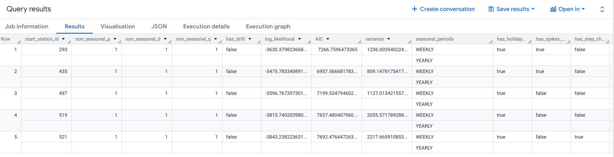

# Forecasting Tutorial BigQuery ML

Based on [Google Skill Boost: Building Demand Forecasting with BigQuery ML](https://www.skills.google/course_templates/511/labs/382994)

You will learn how to build a time series model to forecast the demand of multiple products using BigQuery ML. Using the NYC Citi Bike Trips public dataset, learn how to use historical data to forecast demand in the next 30 days. Imagine the bikes are retail items for sale, and the bike stations are stores.

## Task 1: Explore the NYC Citi Bike Trips dataset

Have a look at the public BQ dataset:

```sql
SELECT
   bikeid,
   starttime,
   start_station_name,
   end_station_name,
FROM
  `bigquery-public-data.new_york_citibike.citibike_trips`
WHERE starttime is not null
LIMIT 5
```

Group the trips by date and station name within a specific time window:

```sql
SELECT
  EXTRACT (DATE FROM TIMESTAMP(starttime)) AS start_date,
  start_station_id,
  COUNT(*) as total_trips
FROM
 `bigquery-public-data.new_york_citibike.citibike_trips`
WHERE
   starttime BETWEEN DATE('2016-01-01') AND DATE('2017-01-01')
GROUP BY
    start_station_id, start_date
LIMIT 5
```

## Task 2. Cleaned training data

From the last query run, you now have one row per date, per start_station, and the number of trips for that day. This data can be stored as a table or view. Run the following query to generate the training data

```sql
CREATE OR REPLACE TABLE `your_project.your_dataset.training_data ` AS
    SELECT
    DATE(starttime) AS trip_date,
    start_station_id,
    COUNT(*) AS num_trips
    FROM
    `bigquery-public-data.new_york_citibike.citibike_trips`
    WHERE
    starttime BETWEEN DATE('2014-01-01') AND ('2016-01-01')
    AND start_station_id IN (521,435,497,293,519)
    GROUP BY
    start_station_id,
    trip_date
```

(if you can't run the command because the public dataset is not in your GCP location, you can download the data as csv and re-upload it as a table in your BQ project)

## Task 3. Training a model

The next query will use the training data to create a ML model. The model produced will enable you to perform demand forecasting.

```sql
CREATE OR REPLACE MODEL `your_project.your_dataset.bike_model`
  OPTIONS(
    MODEL_TYPE='ARIMA_PLUS',
    TIME_SERIES_TIMESTAMP_COL='trip_date', -- column with time points, types allowed: TIMESTAMP, DATE,DATETIME
    TIME_SERIES_DATA_COL='num_trips',      -- column with the data values to forecast
    TIME_SERIES_ID_COL='start_station_id', -- column with the ID of the time series groupings
    AUTO_ARIMA = TRUE,  
    HOLIDAY_REGION='US'
  ) AS
  SELECT
    trip_date,
    start_station_id,
    num_trips
  FROM
    `your_project.your_dataset.training_data`
```

- Execution details: 11.34 seconds
- Slot time consumed: 1 min and 6.41 seconds
- Bytes processed: 1,017.56 KB
- Bytes billed: 10 MB (minimum bytes processed)

When you train a time series model with BigQuery ML, **multiple models/components** are used in the model creation pipeline. ARIMA is one of the core algorithms available in BigQuery ML.

The **components** used are listed in roughly the order of the steps that are run:

- **Pre-processing**: **Automatic cleaning adjustments** to the input time series, including **missing values**, **duplicated timestamps**, **spike anomalies**, and **accounting for abrupt level changes** in the time series history.
- **Holiday effects**: Time series modeling in BigQuery ML can also **account for holiday effects**. By default, holiday effects modeling is disabled. But since this data is from the United States, and the data includes a minimum one year of daily data, you can also specify an optional `HOLIDAY_REGION`. With holiday effects enabled, spike and dip anomalies that appear during holidays will no longer be treated as anomalies. A full list of the holiday regions can be found in the HOLIDAY_REGION documentation.
- **Seasonal and trend decomposition**: using the **Seasonal and Trend decomposition** using LOgical regrESSion (**Loess STL**) algorithm. **Seasonality extrapolation** using the **double exponential smoothing** (**ETS**) algorithm.
- **Trend modeling**: using the **ARIMA model** and the **auto.ARIMA algorithm** for **automatic hyper-parameter tuning**. In auto.ARIMA, dozens of **candidate models** are **trained** and **evaluated in parallel**, which include `p`,`d`,`q` and `drift`. The **best model** comes with the **lowest Akaike information criterion** (**AIC**).

You can **train** a time series model to **forecast** a **single item**, or forecast **multiple items at the same time** (which is really convenient if you have thousands or millions of items to forecast). To forecast multiple items at the same time, **different pipelines are run in parallel**. In this example, since you are training the model on multiple stations in a single model creation statement, you will need to specify the parameter `TIME_SERIES_ID_COL`.

## Task 4. Evaluate the time series model

The **model** produced can be **queried**. Based on the prior query you now have a new model available. You can use the `ML.EVALUATE` function to see the **evaluation metrics** of all the created **models** (one per item):

```sql
SELECT
  *
FROM
  ML.EVALUATE(MODEL `your_project.your_dataset.bike_model`)
```



- The first four columns (`non_seasonal_{p,d,q}` and `has_drift`) define the **ARIMA model**.
- The next three **metrics** (`log_likelihood`, `AIC`, and `variance`) are relevant to the **ARIMA model fitting process**.

The **fitting process** determines the **best ARIMA model** by using the **auto.ARIMA algorithm**, one for each time series. Of these metrics, **AIC** is typically the go-to metric to evaluate **how well a time series model fits the data while penalizing overly complex models**.

## Task 5. Make predictions using the model

Make predictions using `ML.FORECAST`, which **forecasts the next n values**, as set in `horizon`.

You can also change the `confidence_level`, the **percentage that the forecasted values fall within the prediction interval**.

The code below shows a forecast horizon of "30", which means to make predictions on the next 30 days, since the training data was daily.

```sql
SELECT
    *
FROM
    ML.FORECAST(MODEL `your_project.your_dataset.bike_model`,
            STRUCT(30 AS horizon,
                0.90 AS confidence_level)
            )
```

- This query will process 338.36 KB when run (Estimated Cost: $0.00)
- Bytes processed: 338.36 KB
- Bytes billed: 10 MB
